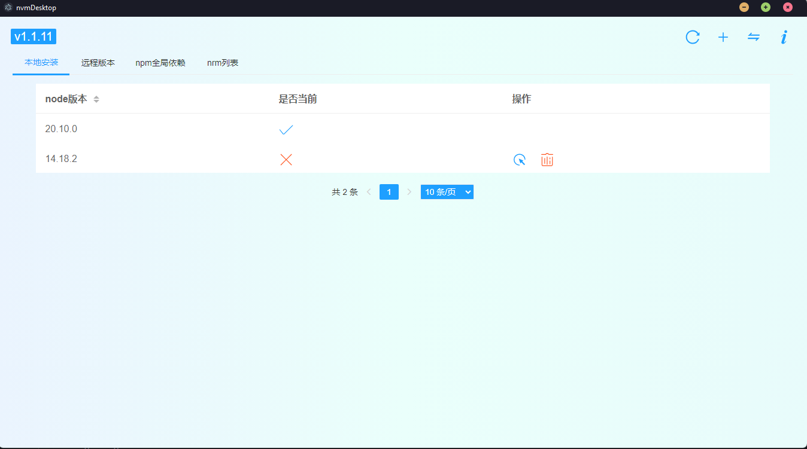
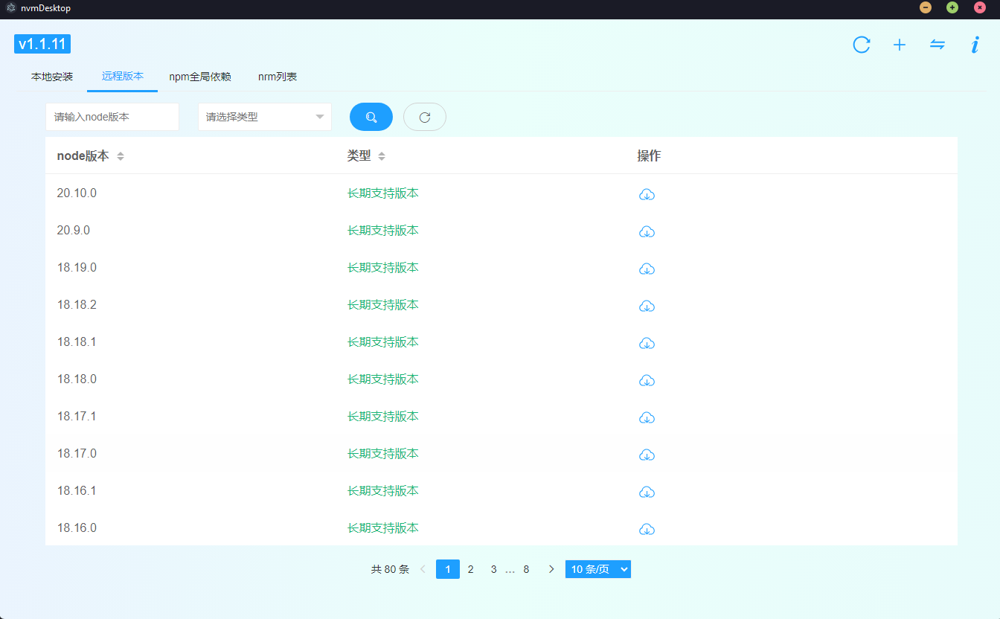
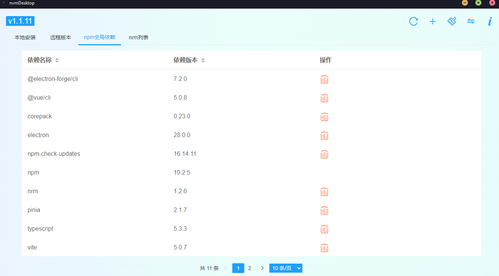
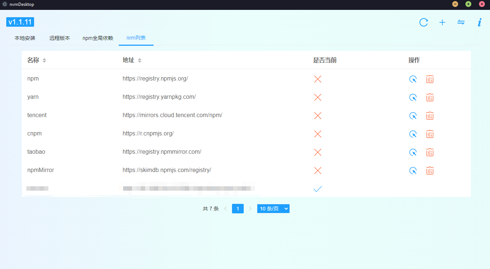

### nvmdesktop

- 本工具需安装NVM后使用
- 暂不支持1.1.12及以上版本（原因：作者增加了isTerminal判断）
- 技术栈：electron，electron-forge，layui
- 功能点：
  - nvm的开关，nvm的proxy、mirror配置
  - 本地node切换，卸载
  - 远程node版本获取，安装
  - npm全局依赖安装，卸载
  - nrm的新增，删除，切换

### 功能预览









### 本地开发
### 环境
node 20+
electron 28+
electron-forge 7+

#### 设置国内镜像源(加速)
```
npm config set registry=https://registry.npmmirror.com
npm config set disturl=https://registry.npmmirror.com/-/binary/node
npm config set electron_mirror=https://registry.npmmirror.com/-/binary/electron/
```

#### 安装依赖
```
npm install
```

#### 启动
```
npm run start
```

#### 打包
```
npm run package
npm run make
```

#### 初始化electron
```
npm install --save-dev electron
npm i -g @electron-forge/cli
electron-forge import
控制台中文乱码需要设置script：chcp 65001 &&
```

#### 安装asar（源代码加密）
```
npm install -D asar
```